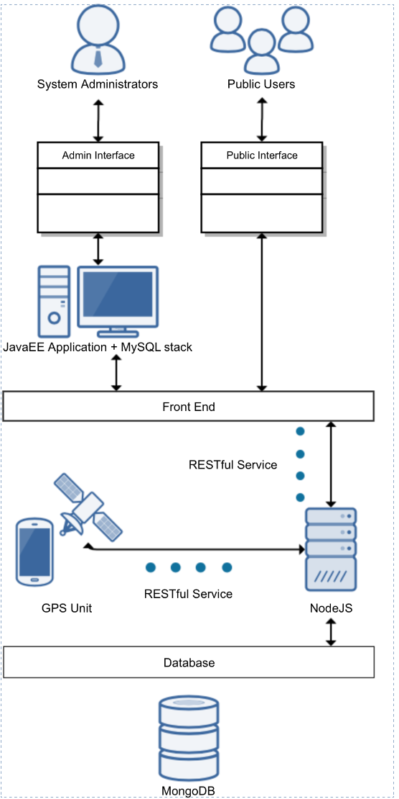

Tracker
=======

Tracker is to help developers to jumpstart developping anykind of mobility tracking applications. 

Tracker lets any type or number of GPS devices to post their locations to a nodejs server through a ReST service.

This consists of several main modules

  1. HTML5+AngularJS Front-end
  2. NodeJS+MongoDB API for collecting and quering tracker data
  3. Php+MySQL back-end to manage the trackers & etc. 
  4. Android app to push data to the API 
  5. Documentation

##Software Architecture 

 
##Installation Guide 

1. Clone the repo using
  ```
git clone https://github.com/scorelab/Tracker.git
```

2. Install node and mongodb.

3. cd to the mobility-track-nodejs folder. Do an npm install. It will install all the pakages.
  ```
cd mobility-track-nodejs
```

  ```
  npm install
  ```

4. Run mongodb. Default path is set to `/data/db` ( On Windows this would be `C:\data\db`). You can change it when you are running.

5. Install grunt-cli with
```
npm install -g grunt-cli
```

6. Now run grunt, it will start the node server and listen to port 3000.
```
grunt
```


